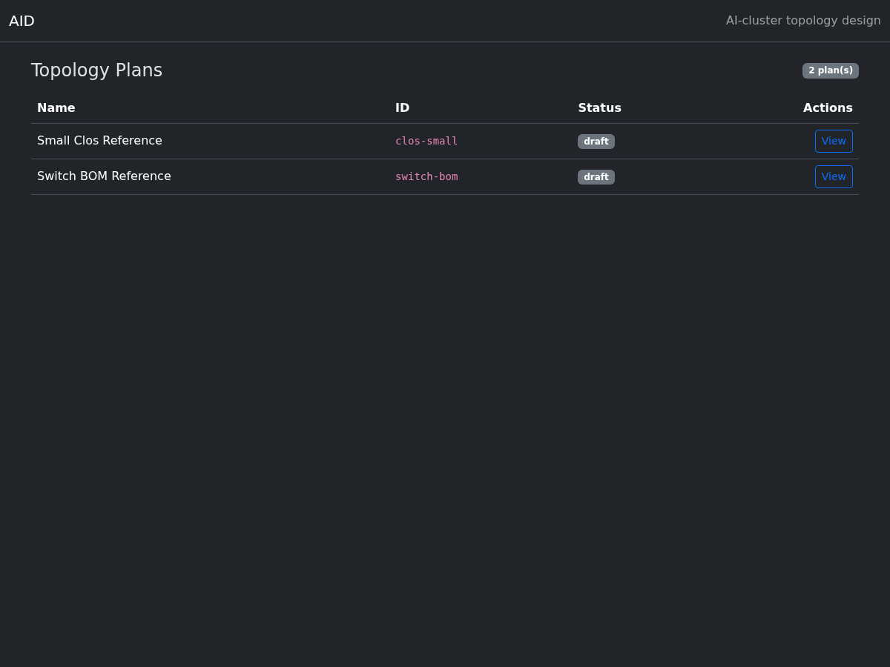
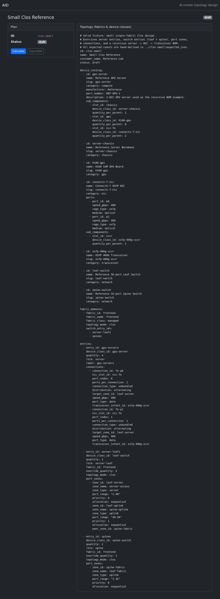
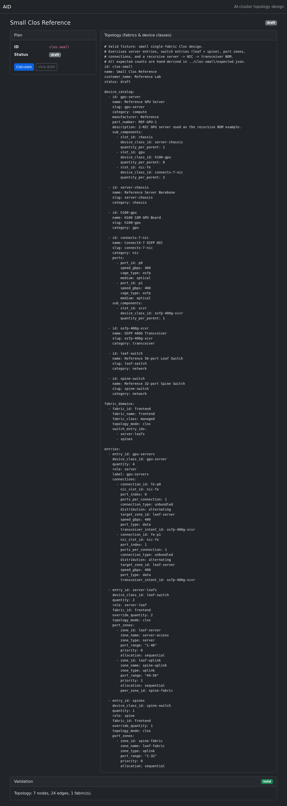
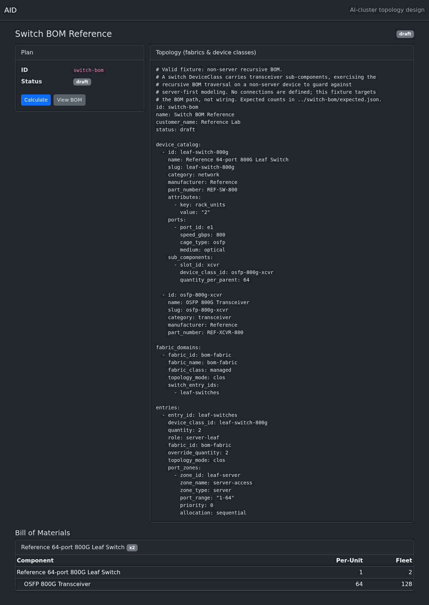

# AID web frontend — browser walkthrough & air-gapped evidence

Phase 6b Stage B exit-gate evidence. The GUI is MoonBit→JS (`ui/src`, compiled to
`ui/static/app.js`) over the Stage-A REST API, with Bootstrap 5 bundled locally
(no CDN). Everything is served by `aid serve` from the embedded `ui/static/`.

## Reproduce

```bash
# 1. Build the bundle + the single static binary (embeds ui/static via go:embed).
make ui
go build -o aid ./cmd/aid

# 2. Run the server with an empty plans dir.
./aid serve --port 8080 --plans-dir /tmp/aid-plans

# 3. Seed two plans (clos-small; switch-bom = the multi-level BOM example).
curl -s -X POST --data-binary @tests/fixtures/valid/clos-small/plan.yaml  http://localhost:8080/api/plans
curl -s -X POST --data-binary @tests/fixtures/valid/switch-bom/plan.yaml http://localhost:8080/api/plans

# 4. Open http://localhost:8080/ and walk: plan list -> View -> Calculate -> View BOM.
```

The screenshots below were captured by driving a real headless Chromium against
the running server (`ui/test/` has the same flow as automated Node smoke tests).

## Walkthrough

### 1. Plan list (`GET /api/plans`)
NetBox-style dark navbar, table of plans, status badges, per-row **View**.



### 2. Plan detail (`GET /api/plans/{id}`)
Cards: plan summary (ID, status, actions) + topology (fabrics & device classes
from the canonical YAML).



### 3. Calc trigger (`POST /api/plans/{id}/calc`)
A green **Valid** badge + IR summary (7 nodes, 24 edges, 1 fabric). A
semantically-invalid plan would show a red **Invalid** badge with the error
codes — validation surfaced as data.



### 4. BOM — per-unit AND fleet (`GET /api/plans/{id}/bom`)
The multi-level `switch-bom` device class (switch → transceiver): per-unit **1 / 64**
and fleet **2 / 128**.



## Air-gapped run (no network; all assets from the binary)

Every request the page makes is same-origin (served from the embedded FS) — there
are **no CDN / external requests**. Captured during the walkthrough above:

```
http://localhost:8080/
http://localhost:8080/static/bootstrap.min.css
http://localhost:8080/static/bootstrap.bundle.min.js
http://localhost:8080/static/app.js
http://localhost:8080/api/plans
http://localhost:8080/api/plans/clos-small
http://localhost:8080/api/plans/clos-small/calc
http://localhost:8080/api/plans/switch-bom
http://localhost:8080/api/plans/switch-bom/bom

external (non-localhost) requests: 0
PASS: all assets loaded from the binary (no CDN).
```
